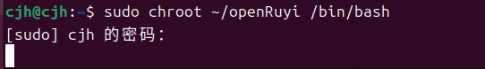
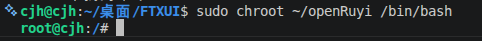

### 本文档介绍了如何通过ruyi-qemu和openRuyi rootfs进行交叉编译

## 安装ruyi-qemu
```bash
$ ruyi install qemu-user-riscv-upstream
# info: package qemu-user-riscv-upstream-8.2.0-ruyi.20240128 installed to /home/cjh/.local/share/ruyi/binaries/x86_64/qemu-user-riscv-upstream-8.2.0-ruyi.20240128
```
## 配置 Linux 机制binfmt_misc
### 确认 ruyi-qemu 可执行文件的位置
```bash
$ ls /home/cjh/.local/share/ruyi/binaries/x86_64/qemu-user-riscv-upstream-8.2.0-ruyi.20240128/bin/qemu-riscv64 
```

### 建立配置目录
```bash
$ mkdir -p /home/cjh/.local/share/ruyi/binaries/x86_64/qemu-user-riscv-upstream-8.2.0-ruyi.20240128/etc/binfmt.d/
```
### 写入配置文件
```bash
$ nano /home/cjh/.local/share/ruyi/binaries/x86_64/qemu-user-riscv-upstream-8.2.0-ruyi.20240128/etc/binfmt.d/qemu-riscv64.conf
$ :ruyi-qemu-riscv64:M::\x7f\x45\x4c\x46\x02\x01\x01\x00\x00\x00\x00\x00\x00\x00\x00\x00\x02\x00\xf3\x00:\xff\xff\xff\xff\xff\xff\xff\x00\xff\xff\xff\xff\xff\xff\xff\xff\xfe\xff\xff\xff:/home/cjh/.local/share/ruyi/binaries/x86_64/qemu-user-riscv-upstream-8.2.0-ruyi.20240128/bin/qemu-riscv64:POCF
```
### 将其部署到系统
```bash
$ sudo cp /home/cjh/.local/share/ruyi/binaries/x86_64/qemu-user-riscv-upstream-8.2.0-ruyi.20240128/etc/binfmt.d/qemu-riscv64.conf /etc/binfmt.d/qemu-riscv64.conf
$ sudo systemctl restart systemd-binfmt
```
### 检查状态
```bash
$ cat /proc/sys/fs/binfmt_misc/ruyi-qemu-riscv64
enabled
interpreter /home/cjh/.local/share/ruyi/binaries/x86_64/qemu-user-riscv-upstream-8.2.0-ruyi.20240128/bin/qemu-riscv64
flags: POCF
offset 0
magic 7f454c460201010000000000000000000200f300
mask ffffffffffffff00fffffffffffffffffeffffff
```
## 尝试进入rootfs
 

## ruyi版本检查
```bash
$ ruyi-qemu --version
qemu-riscv64 version 8.2.0 (RuyiSDK 20240128)
Copyright (c) 2003-2023 Fabrice Bellard and the QEMU Project developers
```

## 改用自编译qemu
```bash
$ qemu-riscv64 --version
qemu-riscv64 version 10.2.91 (v11.0.0-rc1-32-g770f50c14f)
Copyright (c) 2003-2026 Fabrice Bellard and the QEMU Project developers
$ sudo nano /etc/binfmt.d/ruyi-riscv64.conf
$ :qemu-riscv64:M::\x7f\x45\x4c\x46\x02\x01\x01\x00\x00\x00\x00\x00\x00\x00\x00\x00\x02\x00\xf3\x00:\xff\xff\xff\xff\xff\xff\xff\x00\xff\xff\xff\xff\xff\xff\xff\xff\xfe\xff\xff\xff:/usr/local/bin/qemu-riscv64:POCF
$ sudo systemctl restart systemd-binfmt
$ cat /proc/sys/fs/binfmt_misc/qemu-riscv64
enabled
interpreter /usr/local/bin/qemu-riscv64
flags: POCF
offset 0
magic 7f454c460201010000000000000000000200f300
mask ffffffffffffff00fffffffffffffffffeffffff
```
## 成功进入
