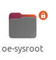
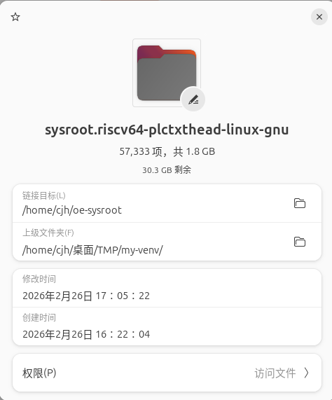
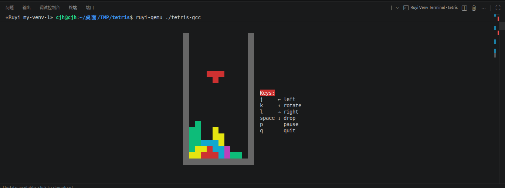

# ruyi包管理可以接入使用者自制的sysroot

## ruyi venv新命令

```bash
$ ruyi venv -h
cjh@cjh:~/桌面$ ruyi venv -h
用法：ruyi venv [-h] [--name NAME] [--toolchain TOOLCHAIN] [--emulator EMULATOR]
             [--with-sysroot] [--without-sysroot]
             [--copy-sysroot-from-pkg COPY_SYSROOT_FROM_PKG]
             [--copy-sysroot-from-dir COPY_SYSROOT_FROM_DIR]
             [--symlink-sysroot-from-dir SYMLINK_SYSROOT_FROM_DIR]
             [--extra-commands-from EXTRA_COMMANDS_FROM]
             profile dest

位置参数：
  profile               环境使用的配置文件
  dest                  新虚拟环境的路径

选项：
  -h, --help            显示该帮助信息并退出
  --name, -n NAME       自定义虚拟环境的名称
  --toolchain, -t TOOLCHAIN
                        要使用的工具链软件包的指示表达式（atoms）
  --emulator, -e EMULATOR
                        要使用的模拟器软件包的指示表达式（atom）
  --with-sysroot        在新虚拟环境内准备一个全新的 sysroot（默认）
  --without-sysroot     不在新虚拟环境内准备任何 sysroot
  --copy-sysroot-from-pkg, --sysroot-from COPY_SYSROOT_FROM_PKG
                        要使用的 sysroot 软件包的指示表达式（atom），如工具链软件包也内置了 sysroot 则优先于它
  --copy-sysroot-from-dir COPY_SYSROOT_FROM_DIR
                        Copy the sysroot from the given directory into the
                        virtual environment
  --symlink-sysroot-from-dir SYMLINK_SYSROOT_FROM_DIR
                        Symlink the virtual environment's sysroot to the given
                        existing directory
  --extra-commands-from EXTRA_COMMANDS_FROM
                        要向新虚拟环境添加额外命令，这些命令的提供者软件包的指示表达式（atoms）
```

主要的新命令主要是以下几条

##  ruyi venv --copy-sysroot-from-pkg  
从指定的系统根目录软件包中复制 sysroot；若工具链自带 sysroot，此参数优先级更高
```bash 
# 示例
$ ruyi venv -t gnu-upstream --copy-sysroot-from-pkg gnu-plct generic ./generic-venv
# gnu-upstream工具链自带sysroot，可通过 --copy-sysroot-from-pkg 参数配置为指定的工具链软件包，比如该实例中的gnu-plct
```

## ruyi venv --copy-sysroot-from-dir    
该指令通过指定本地已有的系统根文件目录（sysroot），将该目录下的所有文件、库、头文件完整地复制一份到虚拟环境路径下，在虚拟环境里乱删库文件也不会影响原始目录，但会占用双倍磁盘空间，如果 sysroot 很大，创建 venv 的过程会比较慢。
```bash
示例
$ ruyi venv -t gnu-plct-xthead --copy-sysroot-from-dir /home/cjh/oe-sysroot sipeed-lpi4a  ./my-venv
# --copy-sysroot-from-dir 参数后给定用户自制的sysroot绝对路径即可，其余参数可不变
```

注意事项，可能会遇到权限问题，我使用此类命令取消了自制sysroot的权限
```bash
$ sudo chown -R root:root ~/oe-sysroot
$ sudo chmod -R 755 ~/oe-sysroot
```


```bash
#根文件权限问题(本次使用的openRuyi的rootfs)
cjh@cjh:~/桌面/TMP$ ruyi venv -t gnu-plct-xthead --copy-sysroot-from-dir /home/cjh/openRuyi sipeed-lpi4a  ./my-venv-1
信息：正在在 my-venv-1 创建 Ruyi 虚拟环境...
Traceback (most recent call last):
  File "/home/cjh/.cache/ruyi/progcache/0.48.0-beta.20260421/linux-x86_64/__main__.py", line 114, in <module>
  File "/home/cjh/.cache/ruyi/progcache/0.48.0-beta.20260421/linux-x86_64/__main__.py", line 110, in entrypoint
  File "/home/cjh/.cache/ruyi/progcache/0.48.0-beta.20260421/linux-x86_64/ruyi/cli/main.py", line 155, in main
  File "/home/cjh/.cache/ruyi/progcache/0.48.0-beta.20260421/linux-x86_64/ruyi/mux/venv/venv_cli.py", line 116, in main
  File "/home/cjh/.cache/ruyi/progcache/0.48.0-beta.20260421/linux-x86_64/ruyi/mux/venv/maker.py", line 471, in do_make_venv
  File "/home/cjh/.cache/ruyi/progcache/0.48.0-beta.20260421/linux-x86_64/ruyi/mux/venv/maker.py", line 595, in provision
  File "/home/cjh/.cache/ruyi/progcache/0.48.0-beta.20260421/linux-x86_64/ruyi/mux/venv/maker.py", line 723, in provision_target
  File "/home/cjh/.cache/ruyi/progcache/0.48.0-beta.20260421/linux-x86_64/shutil.py", line 593, in copytree
  File "/home/cjh/.cache/ruyi/progcache/0.48.0-beta.20260421/linux-x86_64/shutil.py", line 547, in _copytree
shutil.Error: [('/home/cjh/openRuyi/usr/bin/sudoreplay', '/home/cjh/桌面/TMP/my-venv-1/sysroot.riscv64-plctxthead-linux-gnu/usr/bin/sudoreplay', "[Errno 13] Permission denied: '/home/cjh/openRuyi/usr/bin/sudoreplay'"), ('/home/cjh/openRuyi/usr/bin/sudo', '/home/cjh/桌面/TMP/my-venv-1/sysroot.riscv64-plctxthead-linux-gnu/usr/bin/sudo', "[Errno 13] Permission denied: '/home/cjh/openRuyi/usr/bin/sudo'"), ('/home/cjh/openRuyi/var/cache/ldconfig/aux-cache', '/home/cjh/桌面/TMP/my-venv-1/sysroot.riscv64-plctxthead-linux-gnu/var/cache/ldconfig/aux-cache', "[Errno 13] Permission denied: '/home/cjh/openRuyi/var/cache/ldconfig/aux-cache'"), ('/home/cjh/openRuyi/etc/shadow', '/home/cjh/桌面/TMP/my-venv-1/sysroot.riscv64-plctxthead-linux-gnu/etc/shadow', "[Errno 13] Permission denied: '/home/cjh/openRuyi/etc/shadow'"), ('/home/cjh/openRuyi/etc/gshadow', '/home/cjh/桌面/TMP/my-venv-1/sysroot.riscv64-plctxthead-linux-gnu/etc/gshadow', "[Errno 13] Permission denied: '/home/cjh/openRuyi/etc/gshadow'"), ('/home/cjh/openRuyi/etc/shadow-', '/home/cjh/桌面/TMP/my-venv-1/sysroot.riscv64-plctxthead-linux-gnu/etc/shadow-', "[Errno 13] Permission denied: '/home/cjh/openRuyi/etc/shadow-'"), ('/home/cjh/openRuyi/etc/gshadow-', '/home/cjh/桌面/TMP/my-venv-1/sysroot.riscv64-plctxthead-linux-gnu/etc/gshadow-', "[Errno 13] Permission denied: '/home/cjh/openRuyi/etc/gshadow-'"), ('/home/cjh/openRuyi/root/.bash_history', '/home/cjh/桌面/TMP/my-venv-1/sysroot.riscv64-plctxthead-linux-gnu/root/.bash_history', "[Errno 13] Permission denied: '/home/cjh/openRuyi/root/.bash_history'")]

#子文件权限问题(使用的是openEuler的rootfs)
cjh@cjh:~/桌面/TMP$ ruyi venv -t gnu-plct-xthead --copy-sysroot-from-dir /home/cjh/oe-sysroot sipeed-lpi4a  ./my-venv
信息：正在在 my-venv 创建 Ruyi 虚拟环境...
Traceback (most recent call last):
  File "/home/cjh/.cache/ruyi/progcache/0.48.0-beta.20260421/linux-x86_64/__main__.py", line 114, in <module>
  File "/home/cjh/.cache/ruyi/progcache/0.48.0-beta.20260421/linux-x86_64/__main__.py", line 110, in entrypoint
  File "/home/cjh/.cache/ruyi/progcache/0.48.0-beta.20260421/linux-x86_64/ruyi/cli/main.py", line 155, in main
  File "/home/cjh/.cache/ruyi/progcache/0.48.0-beta.20260421/linux-x86_64/ruyi/mux/venv/venv_cli.py", line 116, in main
  File "/home/cjh/.cache/ruyi/progcache/0.48.0-beta.20260421/linux-x86_64/ruyi/mux/venv/maker.py", line 471, in do_make_venv
  File "/home/cjh/.cache/ruyi/progcache/0.48.0-beta.20260421/linux-x86_64/ruyi/mux/venv/maker.py", line 595, in provision
  File "/home/cjh/.cache/ruyi/progcache/0.48.0-beta.20260421/linux-x86_64/ruyi/mux/venv/maker.py", line 723, in provision_target
  File "/home/cjh/.cache/ruyi/progcache/0.48.0-beta.20260421/linux-x86_64/shutil.py", line 593, in copytree
  File "/home/cjh/.cache/ruyi/progcache/0.48.0-beta.20260421/linux-x86_64/shutil.py", line 547, in _copytree
shutil.Error: [('/home/cjh/oe-sysroot/etc/shadow', '/home/cjh/桌面/TMP/my-venv/sysroot.riscv64-plctxthead-linux-gnu/etc/shadow', "[Errno 13] Permission denied: '/home/cjh/oe-sysroot/etc/shadow'"), ('/home/cjh/oe-sysroot/etc/gshadow', '/home/cjh/桌面/TMP/my-venv/sysroot.riscv64-plctxthead-linux-gnu/etc/gshadow', "[Errno 13] Permission denied: '/home/cjh/oe-sysroot/etc/gshadow'"), ('/home/cjh/oe-sysroot/etc/shadow-', '/home/cjh/桌面/TMP/my-venv/sysroot.riscv64-plctxthead-linux-gnu/etc/shadow-', "[Errno 13] Permission denied: '/home/cjh/oe-sysroot/etc/shadow-'"), ('/home/cjh/oe-sysroot/etc/gshadow-', '/home/cjh/桌面/TMP/my-venv/sysroot.riscv64-plctxthead-linux-gnu/etc/gshadow-', "[Errno 13] Permission denied: '/home/cjh/oe-sysroot/etc/gshadow-'")]
```

虚拟环境成功创建结果输出
```bash
$ cjh@cjh:~/桌面/TMP$ ruyi venv -t gnu-plct-xthead --copy-sysroot-from-dir /home/cjh/oe-sysroot sipeed-lpi4a  ./my-venv
信息：正在在 my-venv 创建 Ruyi 虚拟环境...
信息：现已创建完成虚拟环境。

您可“source” bin 目录下合适的激活脚本，以激活此虚拟环境；而后可调用 ruyi-deactivate
以离开它。

在此虚拟环境中，亦为您部署了一套新的 sysroot/prefix 在以下路径：

    /home/cjh/桌面/TMP/my-venv/sysroot

此虚拟环境还内置了开箱即用的 CMake 工具链配置文件（CMake toolchain file）与 Meson
交叉编译文件（Meson cross file）。您可在虚拟环境的根目录找到它们；文件的注释中有使用说明。
```

最终在 my-venv 目录下生成了完整可用的 sysroot，包含 bin、etc、lib、usr 等标准系统目录，说明虚拟环境搭建成功，后续可直接激活环境进行 RISC-V 程序的交叉编译与开发。
```bash
$ cjh@cjh:~/桌面/TMP$ ls /home/cjh/桌面/TMP/my-venv/sysroot
afs  bin  boot  dev  etc  home  lib  lib64  media  mnt  opt  proc  root  run  sbin  srv  sys  tmp  usr  var
```

## --symlink-sysroot-from-dir
该命令不复制文件，此时虚拟环境中的 sysroot 目录实际上是一个软链接，指向你指定的物理目录，但如果你删除了原始目录，虚拟环境就坏了，并且在虚拟环境里误删文件会破坏原始数据。
```bash
$cjh@cjh:~/桌面/TMP$ ruyi venv -t gnu-plct-xthead --symlink-sysroot-from-dir /home/cjh/oe-sysroot sipeed-lpi4a  ./my-venv
信息：正在在 my-venv 创建 Ruyi 虚拟环境...
信息：现已创建完成虚拟环境。

您可“source” bin 目录下合适的激活脚本，以激活此虚拟环境；而后可调用 ruyi-deactivate
以离开它。

在此虚拟环境中，亦为您部署了一套新的 sysroot/prefix 在以下路径：

    /home/cjh/桌面/TMP/my-venv/sysroot

此虚拟环境还内置了开箱即用的 CMake 工具链配置文件（CMake toolchain file）与 Meson
交叉编译文件（Meson cross file）。您可在虚拟环境的根目录找到它们；文件的注释中有使用说明。

```



## 简单游戏编译流程(终端游玩俄罗斯方块~)
```bash
# 获取项目
$ git clone https://github.com/troglobit/tetris.git
$ ruyi venv -t gnu-upstream --symlink-sysroot-from-dir /home/cjh/oe-sysroot  -e qemu-user-riscv-upstream    generic  ./my-venv-1
$ riscv64-unknown-linux-gnu-gcc ./tetris.c -o ./tetris-gcc
$ ruyi-qemu ./tetris-clang
```


 
依赖较多的游戏可以参考另外的几篇博客 
