# v0.1.3测试报告
## [issue39 如意安装下载完成不够明显](https://github.com/ruyisdk/ruyisdk-eclipse-plugins/issues/39)
ruyi使用pipx自动更新时显示报错，显示不支持utf8，但是在ubuntu24.04系统里已经是支持utf8格式的，然后eclipse里我已经设置为utf8格式了，同时ruyi更新完毕，但出现报错，无法到NEXT和finish阶段

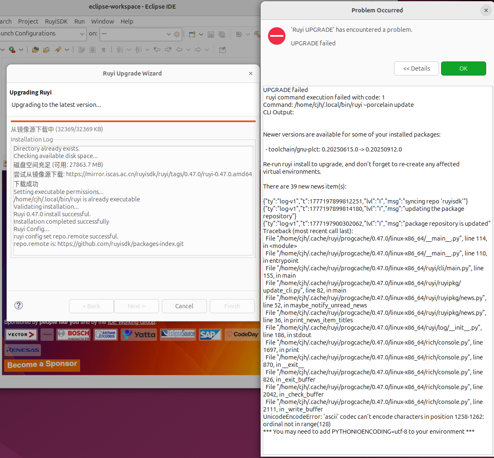
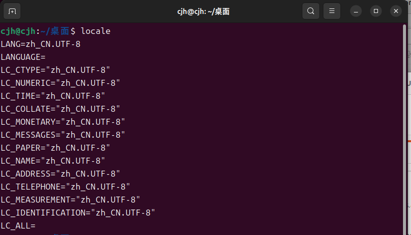

## [issue82 命令执行提示框可以任意关闭且无法重新打开](https://github.com/ruyisdk/ruyisdk-eclipse-plugins/issues/82#issuecomment-4139293344)
下载package时，ok按钮disable，但是可以关掉该页面，后台继续安装重新点击install/uninstall package 按钮显示可安装想对应的package，同时更新页面显示的应该是紧接着关掉页面的后台进度继续安装，最后显示报错，并且package没有正常安装，关掉重新操作，不多开的情况下则正常安装

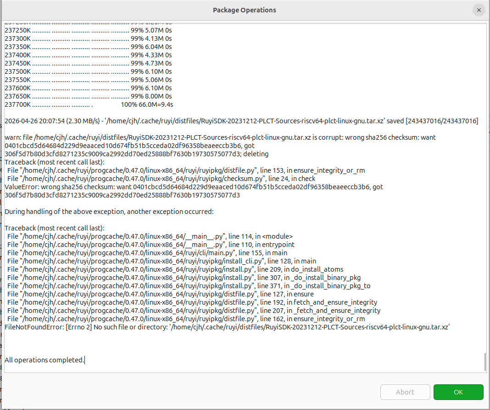

## [issue83 开发板选择框中开发板型号未排序](https://github.com/ruyisdk/ruyisdk-eclipse-plugins/issues/83)
开发板排序，首字母顺序排列以及逆序排列，排序顺序可点击name，needed quirks控制，(needed quirks甚至也排了顺序逆序)

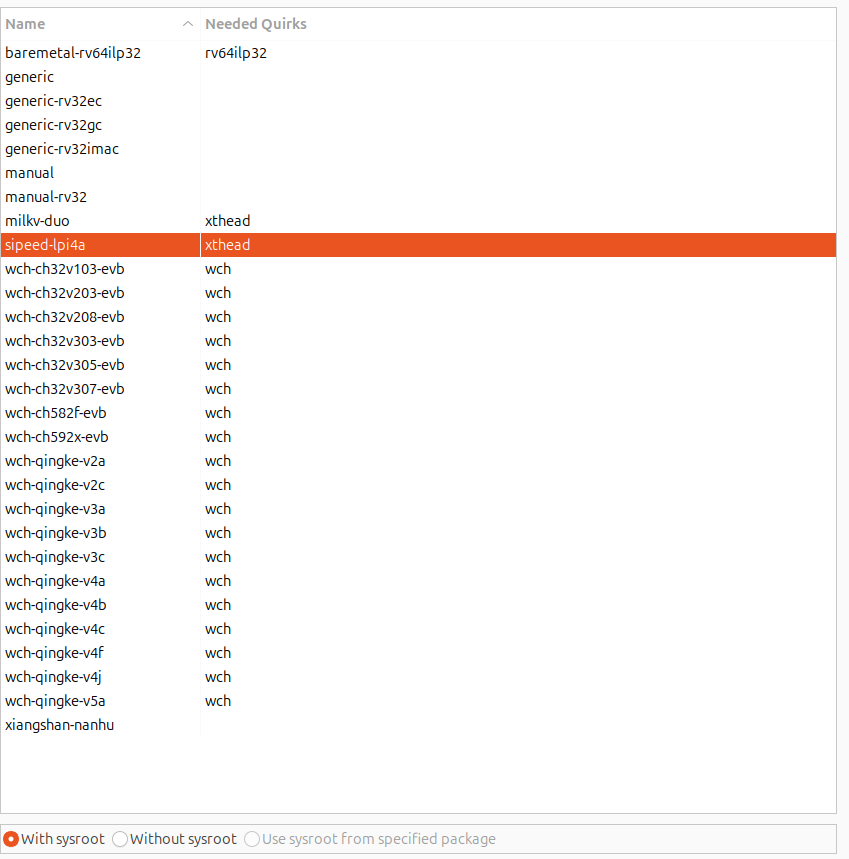

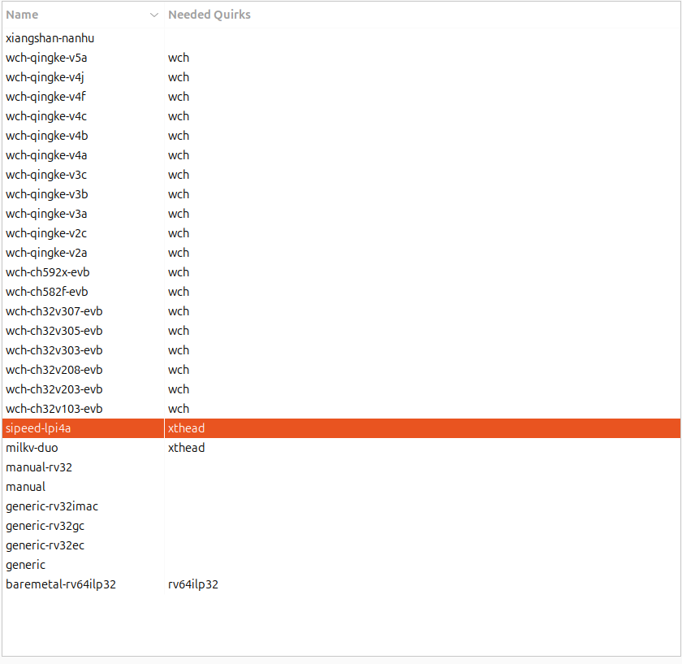

## [issue86 打开 Ruyi Package Explorer 时必须选择某款开发板](https://github.com/ruyisdk/ruyisdk-eclipse-plugins/issues/86)
打开Ruyi Package Explorer不需要强制选择任意一款开发板，同时将在树状视图中显示所有的包。

同时在右侧可以选择某一款特定的开发板，进行过滤(只显示模拟器和工具链，固件烧录没了)

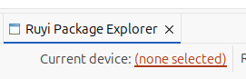

## [issue 87 虚拟环境建立的 quirks 过滤问题](https://github.com/ruyisdk/ruyisdk-eclipse-plugins/issues/87)
在虚拟环境建立页面，可以根据选择的 quirks特性 过滤 toolchain

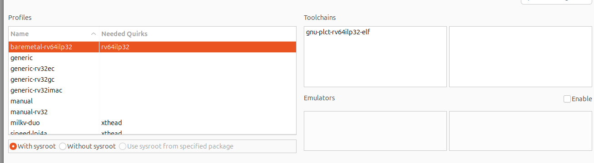

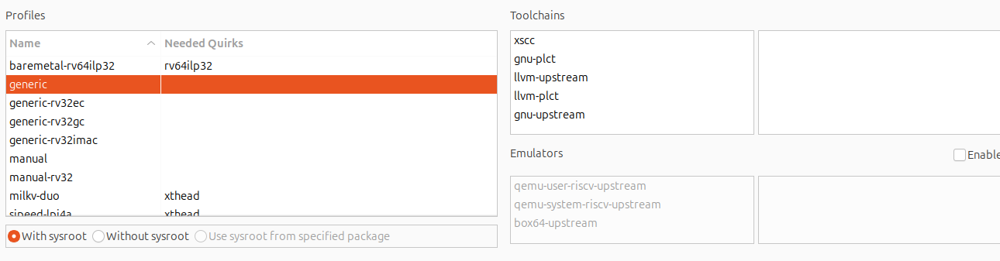

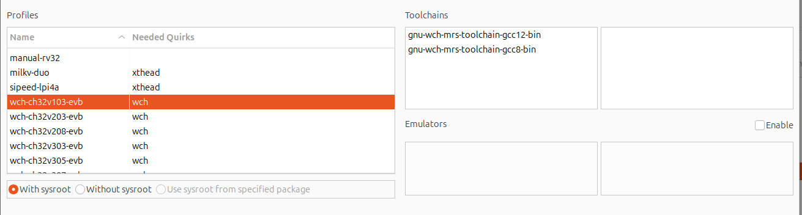

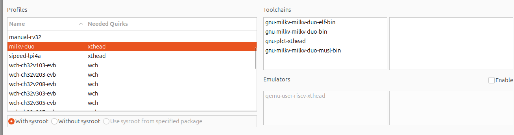

## [issue 88 虚拟环境建立的 ruyi update 错误处理问题](https://github.com/ruyisdk/ruyisdk-eclipse-plugins/issues/88)

由于utf8不可抗力，暂时进不去

## [issue 99 虚拟环境删除后项目目录更新](https://github.com/ruyisdk/ruyisdk-eclipse-plugins/issues/99)

虚拟环境删除后，项目文件列表中的虚拟环境目录会主动消失。

## [issue 109Profiles 列表解析中文](https://github.com/ruyisdk/ruyisdk-eclipse-plugins/issues/109)

原图
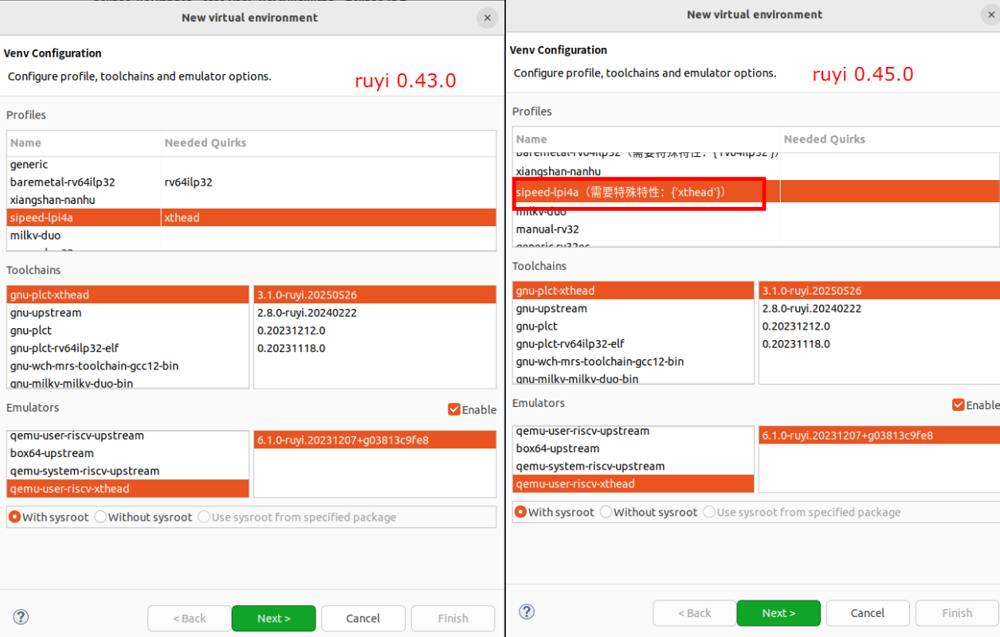

