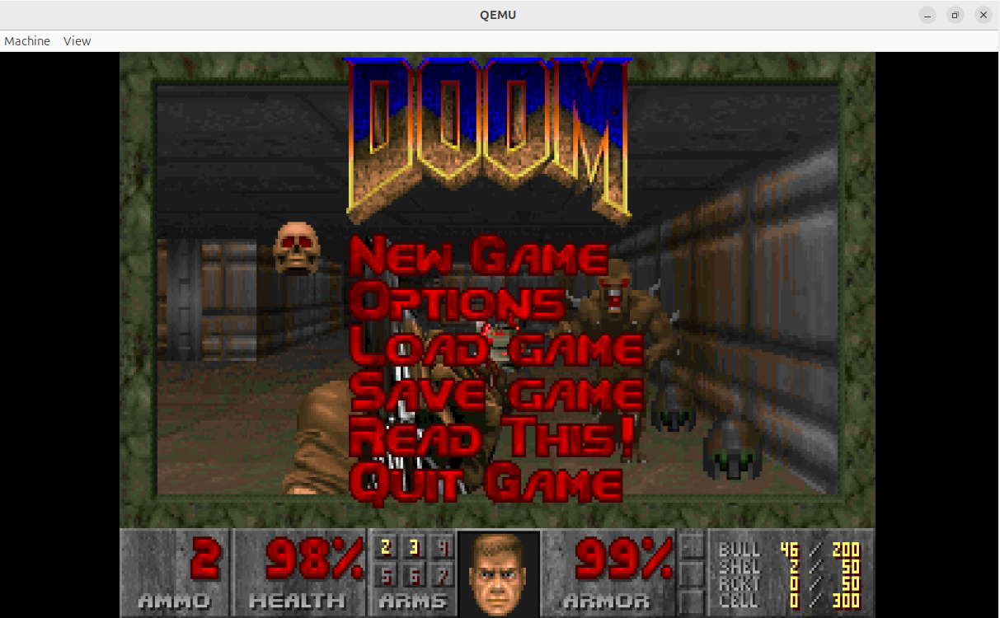

# **在 OpenEuler RISC-V架构的qemu虚拟机上构建Chocolate-Doom开源游戏**
本文档详细说明了如何在运行RISC-V架构  OpenEuler 系统的 qemu 虚拟机上从源代码编译和运行 Chocolate-Doom 开源游戏。

## 安装依赖
```bash
$ sudo dnf update
$ sudo dnf install -y gcc wget git libX11-devel fluidsynth-devel wavpack-devel
```

## 手动编译 SDL2-devel libxmp SDL2_mixer SDL2_net

# 构建 SDL2-devel
```bash
$ git clone --branch release-2.28.x  https://github.com/libsdl-org/SDL.git
$ cd SDL
$ mkdir build && cd build
$ cmake ..
$ make
$ sudo make install
$ sudo ldconfig
```

# 构建 libxmp
```bash
$ git clone https://github.com/libxmp/libxmp.git
$ cd libxmp
$ mkdir build && cd build
$ cmake ..
$ make
$ sudo make install
$ sudo ldconfig
```

# 构建 SDL2_mixer
```bash
$ git clone --branch release-2.8.x  https://github.com/libsdl-org/SDL_mixer.git
$ cd SDL_mixer
$ mkdir build && cd build
$ cmake ..
$ make
$ sudo make install
$ sudo ldconfig
```

# 构建 SDL2_net
```bash
$ git clone --branch release-2.8.x  https://github.com/libsdl-org/SDL_net.git
$ cd SDL_net
$ mkdir build && cd build
$ cmake ..
$ make
$ sudo make install
$ sudo ldconfig
```

# 获取并编译Chocolate-Doom开源游戏
```bash
$ git clone https://github.com/chocolate-doom/chocolate-doom.git
$ cd chocolate-doom
$ mkdir build && cd build
$ cmake ..
$ make
```
# 验证编译结果
编译完成后，你会在 `src` 子目录下看到生成的可执行文件：
```bash
$ ls -l src/chocolate-doom
```
# 运行和测试
由于 chocolate-doom 只是一个引擎，你需要准备 .wad 游戏数据文件才能启动
```bash
$ wget -O doom1.wad https://distro.ibiblio.org/slitaz/sources/packages/d/doom1.wad
```
将安装好的doom1.wad放入`src`子目录下即可运行游戏
```bash
$ ./chocolate-doom 
```
