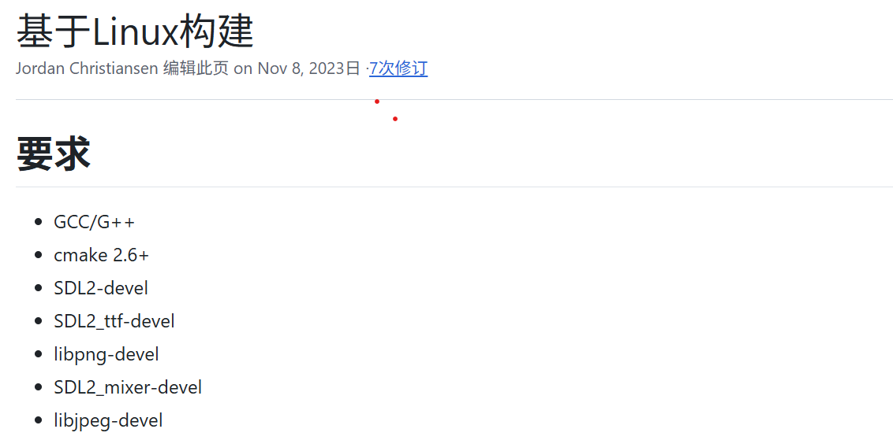
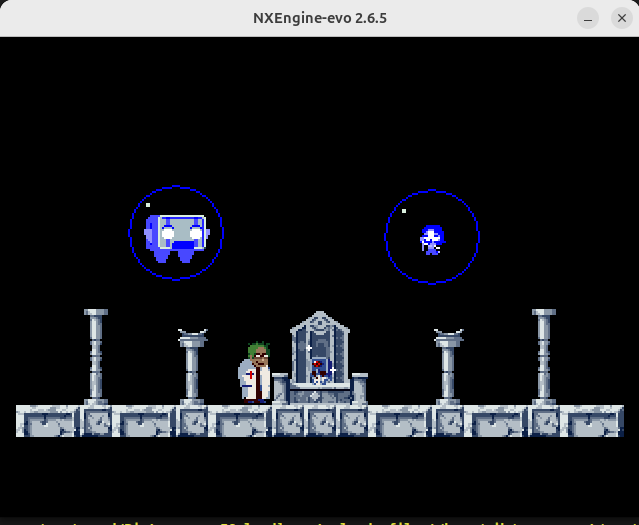
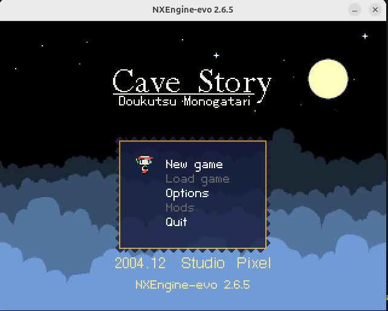
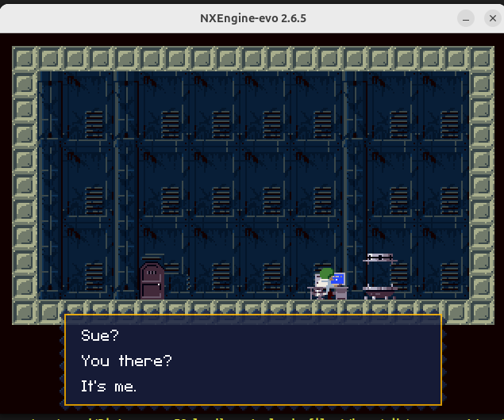

# **在x86架构的ubuntu 24.04.03 LTS上通过ruyisdk虚拟环境构建运行 nxengine-evo引擎并运行cavestoryen**
本文档详细说明了如何在运行x86架构的 ubuntu 虚拟机上通过ruyisdk虚拟环境从源代码编译和运行 nxengine-evo引擎并运行cavestoryen。
## 在 x86 Ubuntu 上构建 openEuler RISC-V Sysroot(同teeworlds) 
### 进入 openEuler 环境安装依赖库

### 其中sdl2全家桶需手动编译
类似流程
```bash
cd ~/桌面/依赖库
wget https://www.alsa-project.org/files/pub/lib/alsa-lib-1.2.11.tar.bz2
tar -jxvf alsa-lib-1.2.11.tar.bz2
cd alsa-lib-1.2.11

# alsa-lib 通常使用传统的 ./configure 方式
./configure --host=riscv64-unknown-linux-gnu \
            --prefix=/usr \
            --with-sysroot=/home/cjh/oe-sysroot \
            CC=/home/cjh/桌面/openspades/ruyi-venv-sipeed-lpi4a/bin/riscv64-plctxthead-linux-gnu-gcc

make -j$(nproc)
make DESTDIR=/home/cjh/oe-sysroot install
```

## 获取并编译 nxengine-evo
```bash
$ git clone --recursive https://github.com/nxengine/nxengine-evo.git
```
## 运用RuyiSDK 虚拟环境交叉编译
### 安装并激活 Ruyi 虚拟环境

### 编译

## 游戏运行



