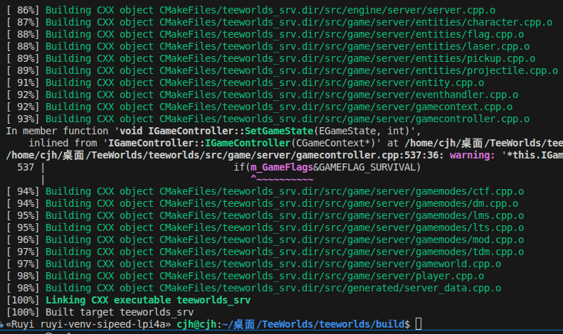

# **在x86架构的ubuntu 24.04.03 LTS上通过ruyisdk虚拟环境构建teeworlds开源游戏**
本文档详细说明了如何在运行x86架构的 ubuntu 虚拟机上通过ruyisdk虚拟环境从源代码编译和运行 teeworlds 开源游戏。

## 在 x86 Ubuntu 上构建 openEuler RISC-V Sysroot
### 安装必要的模拟器和包管理工具
```bash
$ sudo apt update
$ sudo apt install -y qemu-user-static dnf git cmake
```
### 创建并初始化 openEuler 的目录结构
```bash
$ mkdir -p ~/oe-sysroot/usr/bin
$ sudo cp /usr/bin/qemu-riscv64-static ~/oe-sysroot/usr/bin/
```

### 使用 dnf 填充 openEuler 系统
```bash
$ sudo dnf --installroot=$HOME/oe-sysroot \
           --forcearch=riscv64 \
           --releasever=24.03 \
            --repofrompath=oe-base,https://mirrors.huaweicloud.com/openeuler/openEuler-24.03-LTS/OS/riscv64/ \
            --repofrompath=oe-update,https://mirrors.huaweicloud.com/openeuler/openEuler-24.03-LTS/update/riscv64/ \
            --disablerepo=* --enablerepo=oe-base,oe-update \
            --nogpgcheck \
            --setopt=install_weak_deps=False \
            install -y bash coreutils dnf openEuler-release
```
### 配置chroot DNS 域名
```bash
$ sudo cp /etc/resolv.conf ~/oe-sysroot/etc/resolv.conf
```

### 进入 openEuler 环境安装依赖库
```bash
$ sudo chroot ~/oe-sysroot /bin/bash
$ dnf install -y SDL2-devel freetype-devel libpng-devel wavpack-devel mesa-dri-drivers mesa-libGL-devel libX11-devel zlib-devel openssl-devel libXext-devel libXcursor-devel libXinerama-devel libXi-devel  --nogpgcheck --releasever=24.03
```

## 获取并编译teeworlds开源游戏
```bash
$ git clone --recursive https://github.com/teeworlds/teeworlds.git
```

## 运用RuyiSDK 虚拟环境交叉编译
### 安装并激活 Ruyi 虚拟环境

### 在源码toolchains目录创建 riscv64.toolchain
```bash
set(CMAKE_SYSTEM_NAME Linux)
set(CMAKE_SYSTEM_PROCESSOR riscv64)

set(CMAKE_C_COMPILER "riscv64-plctxthead-linux-gnu-gcc")
set(CMAKE_CXX_COMPILER "riscv64-plctxthead-linux-gnu-g++")

set(CMAKE_SYSROOT "/home/cjh/oe-sysroot")

set(CMAKE_FIND_ROOT_PATH "/home/cjh/oe-sysroot")
set(CMAKE_FIND_ROOT_PATH_MODE_PROGRAM NEVER)
set(CMAKE_FIND_ROOT_PATH_MODE_LIBRARY ONLY)
set(CMAKE_FIND_ROOT_PATH_MODE_INCLUDE ONLY)
set(CMAKE_FIND_ROOT_PATH_MODE_PACKAGE ONLY)

set(CMAKE_INCLUDE_PATH "/home/cjh/oe-sysroot/usr/include/freetype2")
set(FREETYPE_LIBRARY "/home/cjh/oe-sysroot/usr/lib64/libfreetype.so")
```

### 赋予权限
```bash
$ sudo chown -R $USER:$USER ~/oe-sysroot
```
### 建立软链接
``` bash
$ cd ~/oe-sysroot
$ sudo ln -s usr/lib64 lib
$ sudo ln -s lib64 usr/lib
$ sudo ln -s ~/oe-sysroot/usr/lib64/dri ~/oe-sysroot/lib64/dri
```

可能会出现的问题：sysroot 里面的 sdl2-config.cmake 文件将包含路径硬编码成了主机系统的 /usr/include/SDL2，而不是映射到 sysroot 内部

#### 修复
```bash
$ nano /home/cjh/oe-sysroot/lib64/cmake/SDL2/sdl2-config.cmake
```

将下述代码进行修改
```bash
set(exec_prefix "/usr")
set(bindir "/usr/bin")
set(libdir "/usr/lib64")
set(includedir "/usr/include")
```
修改为
```bash
set(exec_prefix "${prefix}")
set(bindir "${prefix}/bin")
set(libdir "${prefix}/lib64")
set(includedir "${prefix}/include")
```
### 在虚拟环境中进行交叉编译
```bash
$ cd teeworlds 
$ mkdir build && cd build
$ cmake .. -DCMAKE_TOOLCHAIN_FILE=../cmake/toolchains/riscv64.toolchain
$ make
```



## 通过 ruyi-qemu 运行游戏
### 启动服务器
```bash
$ ruyi-qemu -cpu rv64 -L ~/oe-sysroot ./teeworlds_srv
```


### 启动客户端
```bash
$ xhost +local:
$ DISPLAY=$DISPLAY LIBGL_ALWAYS_SOFTWARE=1 ruyi-qemu -cpu c910 -L ~/oe-sysroot ./teeworlds
```


