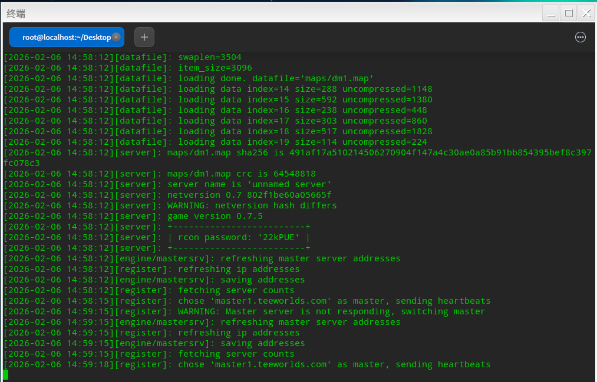
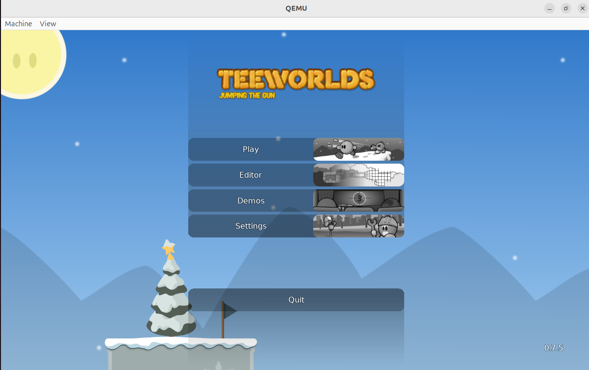
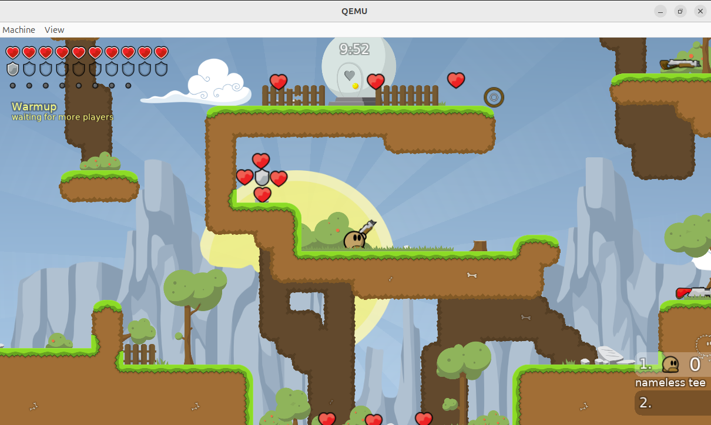

# **在 OpenEuler RISC-V架构的qemu虚拟机上构建teeworlds开源游戏**
本文档详细说明了如何在运行RISC-V架构  OpenEuler 系统的 qemu 虚拟机上从源代码编译和运行 teeworlds 开源游戏。

## 安装依赖
```bash
$ sudo dnf update
$ sudo dnf install -y  git cmake gcc-c++ python3  freetype-devel libpng-devel mesa-libGL-devel libX11-devel wavpack-devel 
```

## 手动编译 SDL2-devel 

### 构建 SDL2-devel
```bash
$ git clone --branch release-2.28.x  https://github.com/libsdl-org/SDL.git
$ cd SDL
$ mkdir build && cd build
$ cmake ..
$ make
$ sudo make install
$ sudo ldconfig
```


## 获取并编译teeworlds开源游戏
```bash
$ git clone --recursive https://github.com/teeworlds/teeworlds.git
$ cd teeworlds
$ mkdir build && cd build
$ cmake ..
$ make
$ sudo make install
$ sudo ldconfig
```

## 运行和测试
编译完成后，你会在 `build` 目录下看到 `teeworlds`（客户端）和 `teeworlds_srv`（服务端）

1.启动本地服务端
```bash
teeworlds_srv &
```


2.启动客户端
```bash
teeworlds
```



