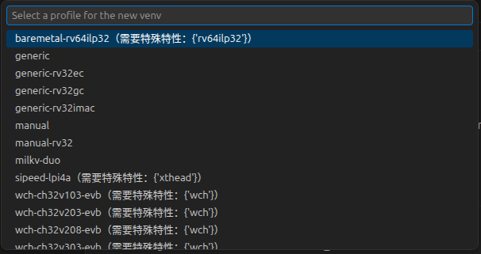
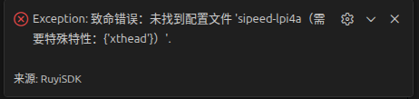

# 环境信息
OS：ubuntu 24.04.3 LTS

测试版本：[0.1.1](https://github.com/ruyisdk/ruyisdk-vscode-extension/releases/tag/0.1.1)

ruyi包管理器版本：[0.45.0](https://github.com/ruyisdk/ruyi/releases/tag/0.45.0)和[0.46.0](https://github.com/ruyisdk/ruyi/releases/tag/0.45.0)

# 预期结果

# 复现流程
交互式创建虚拟环境时profile出现中文乱码

出现乱码的选项创建虚拟环境失败

