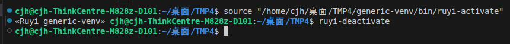
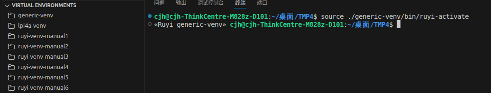
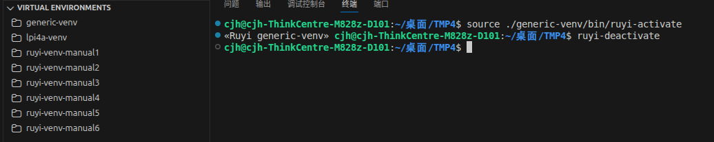
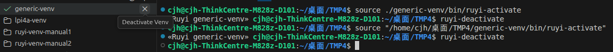
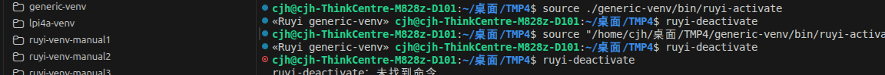

### 环境信息
---
OS: Ubuntu 25.04
插件版本：[0.1.1-beta.1](https://github.com/ruyisdk/ruyisdk-vscode-extension/releases/tag/0.1.1-beta.1)

### 复现流程
---
由于[PR#93](https://github.com/ruyisdk/ruyisdk-vscode-extension/pull/93) 将自动探测当前终端的虚拟环境功能删除，导致了出现了[0.1.0](https://github.com/ruyisdk/ruyisdk-vscode-extension/releases/tag/0.1.0)版本类似的问题。

预期结果：
通过交互式创立虚拟环境后，正常启动虚拟环境以及关闭虚拟环境

出现的问题：
在终端中激活以及关闭虚拟环境并不会改变左侧状态

补充：如果先在左侧启动虚拟环境后，再在终端中手动关闭虚拟环境，左侧仍显示开启状态，并且重复关闭虚拟环境会显示指令不存在

