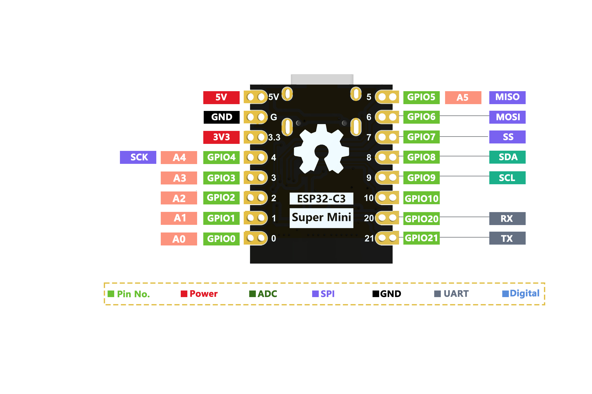
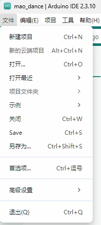
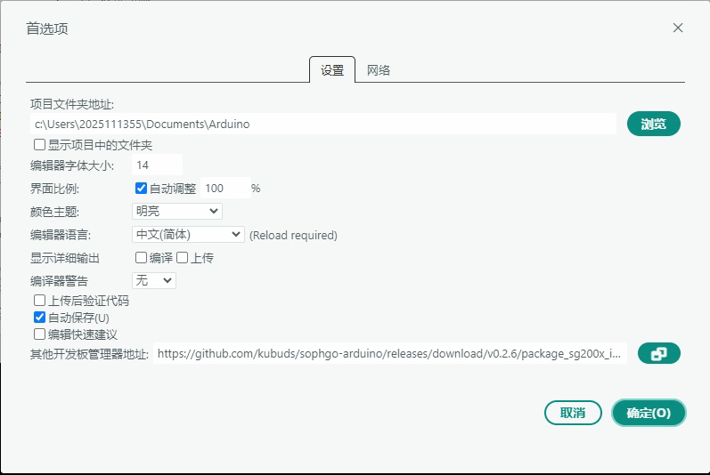
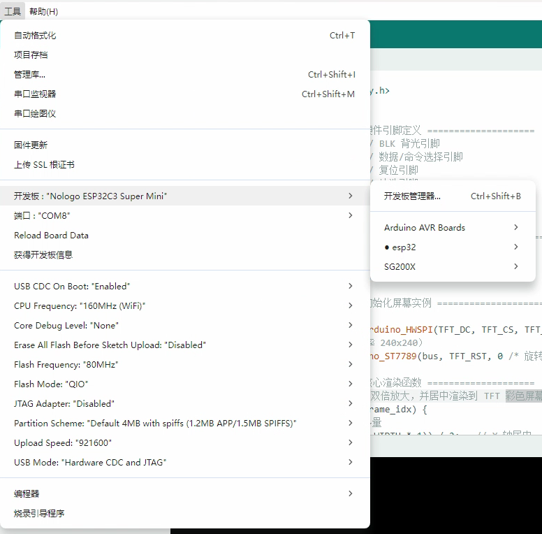
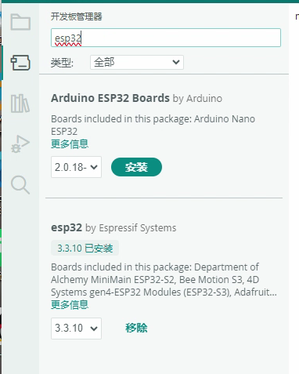
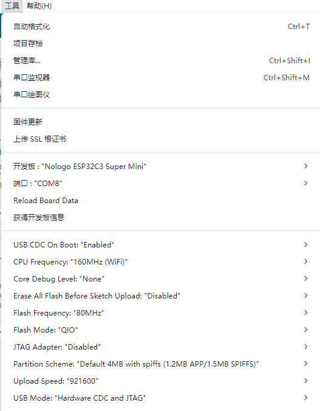
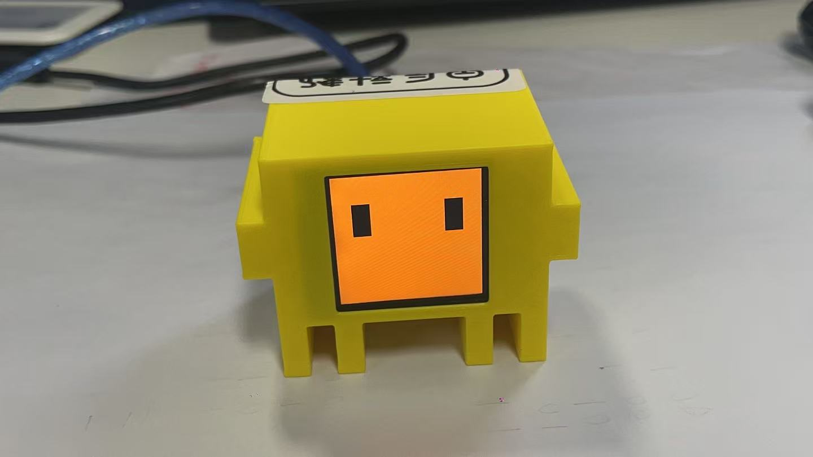

# claude code 桌面机器人
最近心血来潮，想着拿RISC-V开发板尝试一些入门嵌入式，在网上找了一些比较热门的项目，加上最近一直在用claude比较多，刚好看到了橙黄色的cc机器人，门槛不高好操作(主要是便宜)，那这篇blog讲一讲制作cc机器人的全过程吧

## 材料清单
| 物料 |  费用 |
| :------------------------: | :----: | 
| ESP32-C3 SuperMini开发板（焊好排针版+数据线） | 18.29 |
| 1.54寸8针TFT屏（焊好排针版） | 12.90 |
| 8根母对母杜邦线 | 0.50 |
| 3D打印cc外壳 | ≈10 |

比较显眼的是，焊好排针版，新手强烈建议购买焊好排针的版本，深受其害(本人手抖的厉害)，清单上的东西，什么便宜买什么就可以，没有什么特殊要求，外壳的话如果有3D打印机的话也可以自行打印，开源模型[clawd-mochi](github.com/yousifamanuel/clawd-mochi),也可以拿这个模型去找模型代打。

## 接线
需要注意的是，电源一定要接到3v3上，不能接5v，容易烧屏
| TFT屏幕引脚 | ESP32-C3 GPIO  | 
| ----------- | -------------- | 
| VCC         | 3V3            | 
| GND         | GND            | 
| SDA         | GPIO 10 (MOSI) |  
| SCL         | GPIO 8 (SCK)   | 
| RES         | GPIO 2         | 
| DC          | GPIO 1         | 
| CS          | GPIO 4         | 
| BL          | GPIO 3         | 



## Arduino IDE
### 安装
下载[链接](https://www.arduino.cc/en/software/)
### 添加ESP32 开发板
1.打开Arduino IDE →文件→首选项



2.在“其他开发板管理器地址”中粘贴：
```bash
https://raw.githubusercontent.com/espressif/arduino-esp32/gh-pages/package_esp32_index.json
```


3.进入工具→板→板管理器(左侧列表第2个图标)，搜索，安装“esp32 by Espressif Systems






### 库安装
进入工具→库管理器(左侧列表第3个图标)，安装Adafruit GFX Library和Adafruit ST7735 and ST7789 Library


### 配置主板设置



### 编译上传

```bash
# 克隆项目
$ git clone https://github.com/yousifamanuel/clawd-mochi.git
```

通过 USB-C 连接 ESP32 开发板，在工具菜单栏选定对应端口后点击上传按钮，日志出现 RTS 引脚复位提示即代表固件上传完成。


