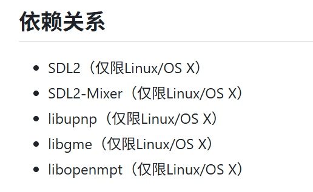
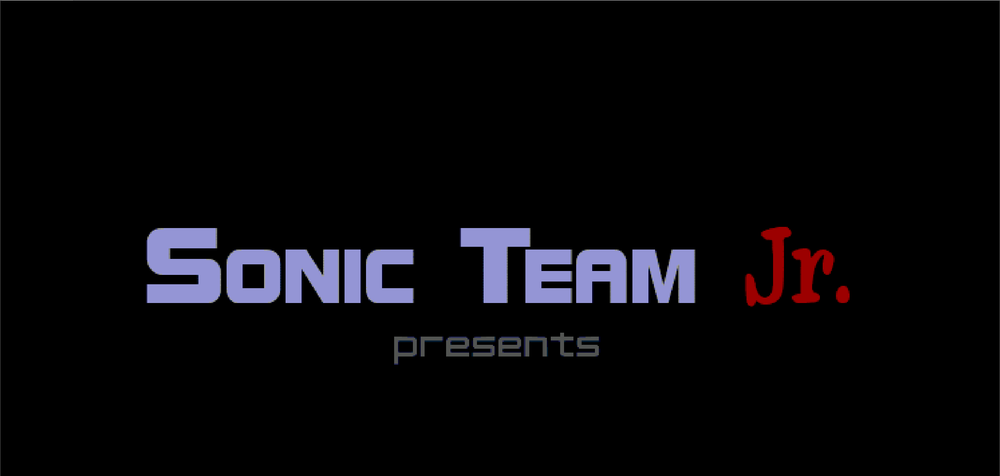
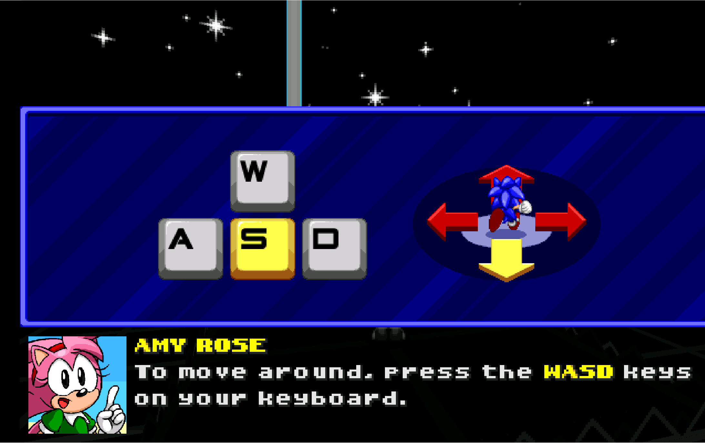
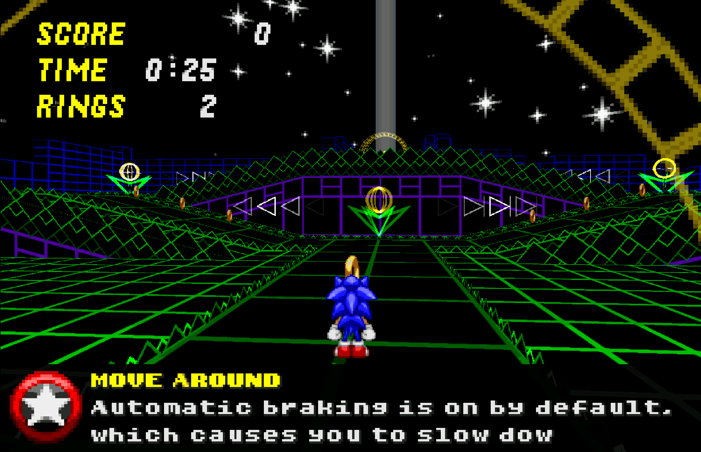

# **在x86架构的ubuntu 24.04.03 LTS上通过ruyisdk虚拟环境构建运行 Sonic Robo Blast 2(索尼克机器人爆炸2)**
本文档详细说明了如何在运行x86架构的 ubuntu 虚拟机上通过ruyisdk虚拟环境从源代码编译和运行 Sonic Robo Blast 2。
## 在 x86 Ubuntu 上构建 openEuler RISC-V Sysroot(同teeworlds) 
### 安装必要的模拟器和包管理工具
```bash
$ sudo apt update
$ sudo apt install -y qemu-user-static dnf git cmake
```
### 创建并初始化 openEuler 的目录结构
```bash
$ mkdir -p ~/oe-sysroot/usr/bin
$ sudo cp /usr/bin/qemu-riscv64-static ~/oe-sysroot/usr/bin/
```

### 使用 dnf 填充 openEuler 系统
```bash
$ sudo dnf --installroot=$HOME/oe-sysroot \
           --forcearch=riscv64 \
           --releasever=24.03 \
            --repofrompath=oe-base,https://mirrors.huaweicloud.com/openeuler/openEuler-24.03-LTS/OS/riscv64/ \
            --repofrompath=oe-update,https://mirrors.huaweicloud.com/openeuler/openEuler-24.03-LTS/update/riscv64/ \
            --disablerepo=* --enablerepo=oe-base,oe-update \
            --nogpgcheck \
            --setopt=install_weak_deps=False \
            install -y bash coreutils dnf openEuler-release
```
### 进入 openEuler 环境安装依赖库

```bash
$ sudo chroot ~/oe-sysroot /bin/bash
$ dnf install -y SDL2-devel  libpng-devel libogg.riscv64 libogg-devel.riscv64  mesa-dri-drivers mesa-libGL-devel libX11-devel zlib-devel openssl-devel libXext-devel libXcursor-devel libXinerama-devel libXi-devel  --nogpgcheck --releasever=24.03
```


(libupnp依赖主要负责联机多人开黑使用，libgme负责一些比较少用的古典音乐，不编译也可以，Cmake会直接跳过)

我们继续回到上次说到的依赖库文件夹(放着我会手动编译的一些依赖~)，在依赖库里我也会建立一个虚拟环境，然后通过`toolchain.chain`文件，将这些依赖进行手动编译，具体内容如下：
```bash
set(CMAKE_SYSTEM_NAME Linux)
set(CMAKE_SYSTEM_PROCESSOR riscv64)


set(CMAKE_C_COMPILER /home/cjh/桌面/依赖库/ruyi-venv-sipeed-lpi4a/bin/riscv64-plctxthead-linux-gnu-gcc)
set(CMAKE_CXX_COMPILER /home/cjh/桌面/依赖库/ruyi-venv-sipeed-lpi4a/bin/riscv64-plctxthead-linux-gnu-g++)


set(CMAKE_SYSROOT /home/cjh/oe-sysroot)
set(CMAKE_FIND_ROOT_PATH /home/cjh/oe-sysroot)


set(CMAKE_FIND_ROOT_PATH_MODE_PROGRAM NEVER)
set(CMAKE_FIND_ROOT_PATH_MODE_LIBRARY ONLY)
set(CMAKE_FIND_ROOT_PATH_MODE_INCLUDE ONLY)
set(CMAKE_FIND_ROOT_PATH_MODE_PACKAGE ONLY)

add_definitions(-DANGELSCRIPT_EXPORT -DAS_RISCV64)
```

### 手动编译缺失依赖
#### 手动编译 `GME(Game Music Emu)`
```bash
$ git clone https://github.com/libgme/game-music-emu.git
$ cd game-music-emu
$ cmake .. \
  -DCMAKE_TOOLCHAIN_FILE=/home/cjh/桌面/依赖库/toolchain.chain \
  -DCMAKE_INSTALL_PREFIX=/home/cjh/oe-sysroot/usr
$ make -j$(nproc)
$ make install
```

#### 手动编译 `libmpg123`
```bash
$ wget https://www.mpg123.org/download/mpg123-1.32.6.tar.bz2
$ tar -xjvf mpg123-1.32.6.tar.bz2
$ cd mpg123-1.32.6
$ ./configure \
  --host=riscv64-plctxthead-linux-gnu \
  --prefix=/home/cjh/oe-sysroot/usr \
  --with-sysroot=/home/cjh/oe-sysroot \
  --enable-shared \
  --disable-static \
  --with-optimization=0
$ make -j$(nproc)
$ make install
```

#### 手动编译 `libopenmpt`
```bash
$ wget https://lib.openmpt.org/files/libopenmpt/src/libopenmpt-0.7.3+release.autotools.tar.gz
$ tar -xzvf libopenmpt-0.7.3+release.autotools.tar.gz
$ cd libopenmpt-0.7.3+release.autotools
$ ./configure \
  --host=riscv64-plctxthead-linux-gnu \
  --prefix=/home/cjh/oe-sysroot/usr \
  --with-sysroot=/home/cjh/oe-sysroot \
  --enable-shared \
  --disable-static \
  --without-mpg123 \
  CPPFLAGS="-I/home/cjh/oe-sysroot/usr/include" \
  LDFLAGS="-Wl,-rpath=/home/cjh/oe-sysroot/usr/lib64 -L/home/cjh/oe-sysroot/usr/lib64" \
  ZLIB_CFLAGS="-I/home/cjh/oe-sysroot/usr/include" \
  ZLIB_LIBS="-lz" \
  CC="riscv64-plctxthead-linux-gnu-gcc --sysroot=/home/cjh/oe-sysroot" \
  CXX="riscv64-plctxthead-linux-gnu-g++ --sysroot=/home/cjh/oe-sysroot"
$ make -j$(nproc)
$ make install
```

## 使用RuyiSDK交叉编译Sonic Robo Blast 2
### 获取项目源代码
```bash
$ git clone https://github.com/STJr/SRB2.git srb2-latest
```
### 激活虚拟环境使用ruyisdk交叉编译源代码
```bash
$ mkdir build && cd build
$ cmake -DCMAKE_TOOLCHAIN_FILE="/home/cjh/桌面/srb2-legacy/toolchain.chain"                  
  -D CMAKE_BUILD_TYPE=Release       
  -DCMAKE_INSTALL_PREFIX="/home/cjh/oe-sysroot/usr"       
  -DCMAKE_EXE_LINKER_FLAGS="--sysroot=/home/cjh/oe-sysroot"       
  ..
$ make -j$(nproc)
$ make install
```
### 获取游戏资源
```bash
$ wget https://github.com/STJr/SRB2/releases/download/SRB2_release_2.2.15/SRB2-v2215-Full.zip
$ unzip ~/桌面/SRB2-v2215-Full.zip -d ~/桌面/SRB2-Resources
```
将游戏资源SRB2-Resources里的素材放进之前编译Sonic Robo Blast 2的产物目录下(build/bin)

## 启动游戏
```bash
$ chmod +x lsdl2srb2
$ RUYI_TELEMETRY_DISABLED=1 LD_LIBRARY_PATH=~/oe-sysroot/usr/lib:. ruyi-qemu -cpu rv64 -L ~/oe-sysroot ./lsdlsrb2
```




