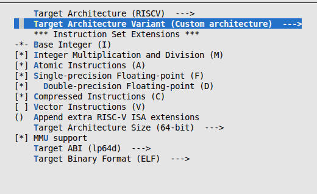
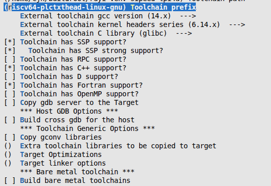
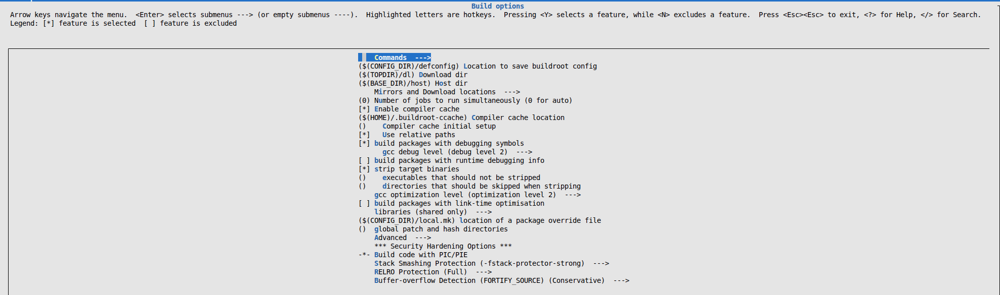
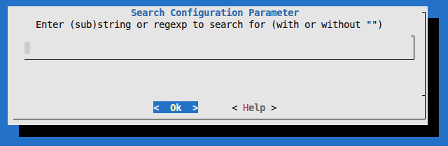
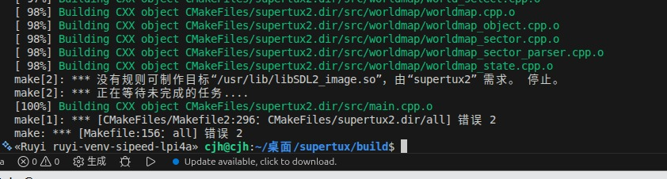
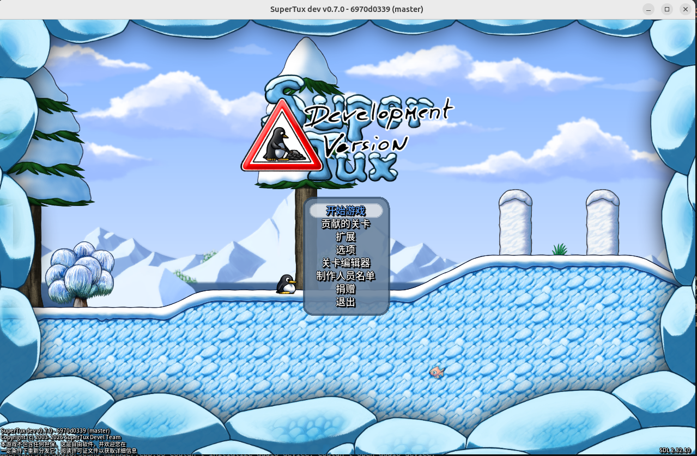
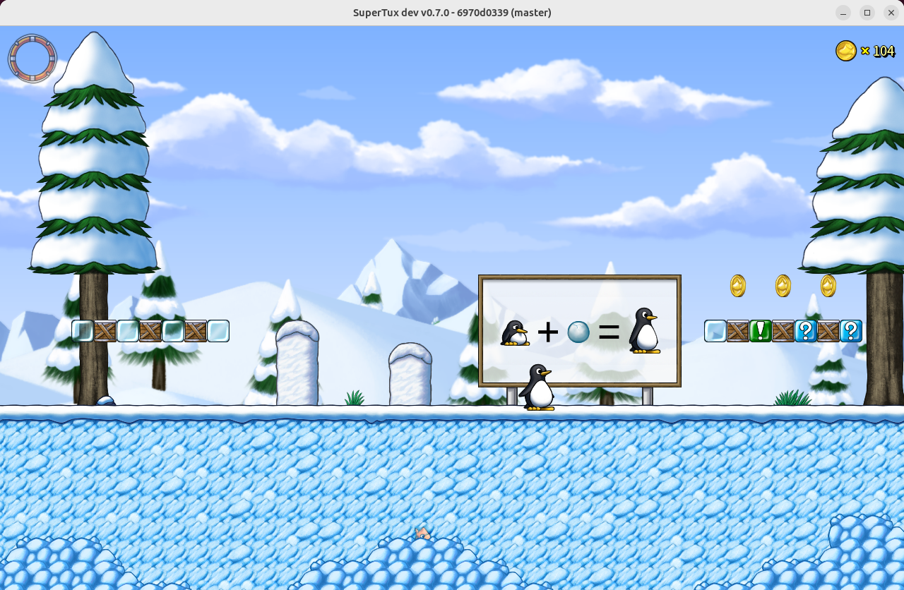

# **在x86架构的ubuntu 24.04.03 LTS上通过ruyisdk虚拟环境构建运行 supertux**
本文档详细说明了ruyisdk虚拟环境从源代码编译和运行 supertux 。
## buildroot
之前的blog通常是通过clone github上的缺失的依赖，然后通过工具链进行手动编译，不仅效率低，而且可能会造成依赖地狱(编译了第一个依赖时发现这个依赖却需要编译另一个依赖，循环下来不知道要编译多少个才能终结，深受折磨)，今天来玩点不一样的，buildroot闪亮登场，可以通过 Buildroot 一键配置、自动交叉编译所需的第三方库与系统组件，生成与目标平台完全兼容的依赖文件，解决开发中依赖缺失问题。
### 获取 buildroot
- 方法一
```bash
# 从GitHub仓库进行克隆
$ git clone https://github.com/buildroot/buildroot.git
```
- 方法二
```bash
# 从gitlab官方仓库进行克隆
$ git clone https://gitlab.com/buildroot.org/buildroot.git
```
- 方法三
```bash
# 从buildroot官网进行下载安装
```bash
https://buildroot.org/download.html
```
### 配置buildroot
```bash
$ make menuconfig
```

#### 架构选择
在`Target options` -> `Target Architecture` -> `RISCV`


在`Target options` -> `Target Architecture Variant` -> `Custom architecture`




#### 工具链选择
在`Toolchain` -> `Toolchain type` -> `External toolchain`

在`Toolchain` -> `Toolchain` -> `Custom toolchain `

在`Toolchain` -> `Toolchain` -> ` Toolchain origin (Pre-installed toolchain)`->`/home/cjh/buildroot/ruyi-venv-sipeed-lpi4a`

(这里是你当前虚拟环境工具链的路径，到虚拟环境即可，由于可能识别不到中文，建议放在主目录下即可)  
在`Toolchain` -> `Toolchain` -> `Toolchain prefix`-> `riscv64-plctxthead-linux-gnu`

(这里是交叉工具链的前缀)  
以及一些工具链的相关参数，可以用 `riscv64-plctxthead-linux-gnu-gcc -v` 查到一些，如果填错也没关系，buildroot在make阶段报错会提醒的，之后再改也可以。



### 剩余选项



### 依赖补充
在`Target Packages`里可以根据分类选择你所需要的依赖即可，选择与否可以用空格确定，如果找不到的话，你也可以通过`/`键快速搜索确定位置



### 编译
确定好所需依赖(如果有依赖没选上的make失败后也可以重新补充)后通过`ESC`退出确认配置
```bash
# 编译依赖
$ make
```
## 构建supertux

### 获取supertux源码进行交叉编译
```bash
$ git clone https://github.com/SuperTux/supertux.git
```
### 编写toolchain.cmake
```bash
set(CMAKE_SYSTEM_NAME Linux)
set(CMAKE_SYSTEM_PROCESSOR riscv64)

set(CMAKE_C_COMPILER "/home/cjh/桌面/supertux/ruyi-venv-sipeed-lpi4a/bin/riscv64-plctxthead-linux-gnu-gcc")
set(CMAKE_CXX_COMPILER "/home/cjh/桌面/supertux/ruyi-venv-sipeed-lpi4a/bin/riscv64-plctxthead-linux-gnu-g++")

set(CMAKE_SYSROOT "/home/cjh/buildroot/output/staging")
set(CMAKE_FIND_ROOT_PATH "/home/cjh/buildroot/output/staging")

set(CMAKE_FIND_ROOT_PATH_MODE_PROGRAM NEVER)
set(CMAKE_FIND_ROOT_PATH_MODE_LIBRARY ONLY)
set(CMAKE_FIND_ROOT_PATH_MODE_INCLUDE ONLY)
set(CMAKE_FIND_ROOT_PATH_MODE_PACKAGE ONLY)

set(PKG_CONFIG_EXECUTABLE "/home/cjh/buildroot/output/host/bin/pkg-config")
set(ENV{PKG_CONFIG_SYSROOT_DIR} ${CMAKE_SYSROOT})
set(ENV{PKG_CONFIG_PATH} "${CMAKE_SYSROOT}/usr/lib/pkgconfig") 
```
### supertux需要的一些依赖
`sdl2 sdl2_image sdl2_mixer sdl2_ttf libcurl libogg libvorbis glm fmt physfs libX11`
可能有所遗漏，如果缺少依赖的话请根据上文自行补充即可

### 交叉编译
```bash
$ cmake .. -DCMAKE_TOOLCHAIN_FILE=../toolchain.cmake
$ make -j$(nproc)
```
###小问题  



如果出现如上问题，sdl2_image链接失败的情况，是由于cmake硬编码导致去宿主机找sdl2_image了，需要更改为buildroot路径下的sdl2_image,代码参考如下
```bash
$ sed -i 's|/usr/lib/libSDL2_image.so|/home/cjh/buildroot/output/staging/usr/lib/libSDL2_image.so|g' CMakeFiles/supertux2.dir/build.make
$ sed -i 's|/usr/lib/libSDL2_image.so|/home/cjh/buildroot/output/staging/usr/lib/libSDL2_image.so|g' CMakeFiles/supertux2.dir/link.txt
```
### 运行
```bash
$ xhost +local:
$ ruyi-qemu -cpu thead-c906 \
  -L /home/cjh/buildroot/output/staging \
  -E DISPLAY=$DISPLAY \
  -E SDL_VIDEODRIVER=x11 \
  -E LD_LIBRARY_PATH="/usr/lib:/lib:/usr/lib64/lp64d:/lib64/lp64d:." \
  ./supertux2
```



