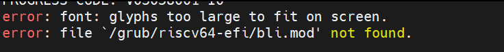
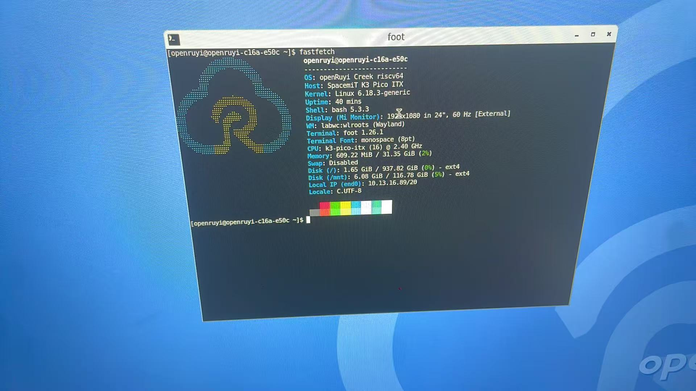

# 在 K3 上折腾 OpenRuyi 系统

最近手上有个 K3的开发板，16 核 RISC-V，32G 内存，128G硬盘。开发板预装了 Bianbu 的u-boot系统，想把 OpenRuyi 装到 NVMe 上，整个过程比我预想的折腾很多。记录一下。

## 烧录 Bianbu uefi 镜像
先来叙述一下烧录 Bianbu uefi 镜像的过程，uefi体验版镜像的[链接](https://archive.spacemit.com/image/k3/version/bianbu/v4.0/Bianbu-LXQt-UEFI-K3-v4.0-20260430171239.tar.gz)。  
进迭时空推荐的烧录方式有两种：  

1.设备未上电，处于关机状态时  
- 按住 烧录按键 FDL 不松开。  
- 连接全功能 Type-C 数据线或插上电源，给设备供电。  
- 松开 烧录按键 FDL。  
- 使用烧录用 Type-C 数据线，将 DRD 的 Type-C 接口接到上位机电脑。  
- 使用进迭时空官方刷机工具 Titan[Windows版](https://cloud.spacemit.com/prod-api/release/download/tools?token=titantools_for_windows_X86_X64)和[Linux版](https://cloud.spacemit.com/prod-api/release/download/tools?token=titantools_for_linux_64BIT_APPIMAGE) 或`fastboot`命令即可进行操作。

2.设备已插上Type-C 全功能线或ATX电源供电，并处于开机状态时  
- 按住 烧录按键 FDL 不松开。
- 短按 复位键 RST。
- 松开 烧录按键 FDL。
- 使用烧录用 Type-C 数据线，将 DRD 的 Type-C 接口接到上位机电脑。
- 使用进迭时空官方刷机工具 Titan[Windows版](https://cloud.spacemit.com/prod-api/release/download/tools?token=titantools_for_windows_X86_X64)和[Linux版](https://cloud.spacemit.com/prod-api/release/download/tools?token=titantools_for_linux_64BIT_APPIMAGE) 或`fastboot` 命令即可进行操作。

具体操作流程可以看一下[刷机工具手册](https://www.spacemit.com/community/document/info?lang=zh&nodepath=tools/user_guide/flasher_user_guide.md)，按照流程就可以正常将 uefi 镜像烧录进开发板。
## uefi 镜像 GRUB 界面无法正常映射到显示屏
在第一次尝试烧录uefi镜像后，刚开始认为只是开机慢，多等一会还是没见显示屏点亮，感觉有点不对劲，以为烧坏了，又从官网上把 u-boot 烧回去了，正常点亮，流程方面应该就没有什么问题了，再几度烧录uefi镜像还是没法点亮显示屏后，买了串口工具，准备监测一下后台，恩，GRUB 加载的字体字号过大，超出当前屏幕分辨率，无法渲染。所以目前启动得通过串口工具启动镜像，加载系统后可以正常在显示屏上显示。




## dd 出来的 U 盘 GRUB 不认

K3 的启动是 ROM → SPI Flash → UEFI → GRUB → 系统。固件已经烧好了，想着把 OpenRuyi 的 ISO dd 到 U 盘插上就能装。结果 GRUB 根本不认这个 U 盘，菜单里只有 Bianbu 和 Settings。然后settings选项回车后会直接卡死，(其实workstation镜像加载了也无法正常烧录，该镜像应该是针对2044服务器适配的，移植到K3上有一些小问题需要调整)

换思路。从 Bianbu 系统里进去，直接把 ISO 镜像解开扔到 NVMe 上。

ISO 里面是两层。外面一层 squashfs（416M），里面再套一个 2G 的 ext4 镜像才是真正的 rootfs。挂上、cp 到 NVMe、改 fstab，收工。

## 内核不说话

配好 GRUB，选了 OpenRuyi，重启。

```
Loading OpenRuyi kernel 7.0.2...
Loading OpenRuyi initrd...
PROGRESS CODE: V03101019 I0
```

然后什么都没有。串口上除了 Boot ROM 那行 PROGRESS CODE，内核一个字都没输出。

折腾了一圈发现两个问题。一个是 GRUB 里没写 `devicetree`，另一个是 `quiet splash` 把输出吞了。加上 `earlycon=sbi` 和 DTB 重试，终于看到东西了：

```
Linux version 7.0.2-106.1.or
Machine model: SpacemiT K3 Pico-ITX
```

但只高兴了一行。85 行之后：

```
printk: legacy bootconsole [sbi0] disabled
```

然后串口又死了。原因很简单——K3 的串口是 XScale 8250 兼容的，OpenRuyi 这个 7.0.2 内核没编进去。earlycon 只是借 SBI 固件的通道打字的，真正的串口驱动一切换，发现没有，就没然后了。内核其实还在跑，只是嘴巴被封上了。

## 借 Bianbu 内核用

反正 Bianbu 的内核在板子上跑得好好的，直接用它的。

把 `/boot/vmlinuz-6.18.3-generic` 和 initrd、DTB 拷到 `/boot/openruyi/` 下，GRUB 里指过去。重启。

```
Loading kernel...
Loading initrd...
Loading DTB...
PROGRESS CODE: V03101019 I0
```

又黑屏。这回连 earlycon 都没反应。MD5 检查了一下，文件没问题。同样的内核，Bianbu 能启动，我们不行。

试了半天发现是路径的问题。`/boot/openruyi/vmlinuz` 这个子目录路径就是不行，换成根目录的 `/vmlinuz-6.18.3-generic` 就好了。GRUB 的 ext2 驱动在不同路径下行为不一样，到现在也没搞懂为什么。懒得深究了，直接用了原来的路径和文件名，只把 `root=UUID` 改成了 NVMe 的。

重启，串口打印 994 行日志。16 核全上线，NVMe、SATA、网卡、USB 全认到。成了。

## 画面被 Plymouth 吃了

系统启动了，串口能登进去，labwc 也在跑，但是显示器一直卡在 Bianbu 的 Logo 画面上不动。

plymouthd 没退出。它占着 framebuffer，labwc 在上面一层被完全盖住了。

`sudo kill $(pgrep plymouthd)`，画面切到 OpenRuyi 桌面。壁纸出来了。


## GPU

桌面出来之后画面有撕裂。一看日志，`VK_ERROR_INCOMPATIBLE_DRIVER`。

OpenRuyi 的 rootfs 没带 PowerVR 的驱动。K3 用的 GPU 是 IMG BXE 系列，需要一整套闭源用户态库。从 Bianbu 那边搬过来了 pvr_dri.so、libVK_IMG.so、libsrv_um.so、libusc.so 等十几个文件。依赖都解了，ldd 全绿，但 Vulkan 还是初始化失败。内核里的 pvrsrvkm 版本和用户态的 libVK_IMG 对不上号。桌面能用，靠 16 个核纯软件画 1920x1080，影响不大但对眼睛不太友好。


## fastfetch



