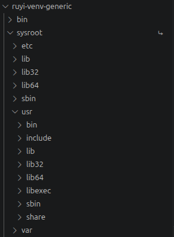

# 本文档详细介绍sysroot
在嵌入式开发、跨架构编译过程中，大概率会遇到一个疑问：sysroot到底是什么？ 明明已经装了交叉编译器，为什么加上--sysroot参数才能编译通过？不加就会报“头文件找不到”“库链接失败”？
# sysroot的本质
其实，sysroot本质是“目标系统的本地镜像”。它的全称是System Root，系统根目录，是交叉编译环境中，一个模拟目标平台文件系统结构的目录，里面存放了目标设备（比如RISC-V开发板、树莓派）所需的所有系统级资源——包括头文件、库文件、动态链接器，甚至部分配置文件，相当于把目标设备的“根目录”，完整复制到了开发主机上。  

sysroot目录包含以下子目录：
```
sysroot/
├── usr/
│   ├── include/       # 目标系统的 C/C++ 头文件（如 stdio.h, stdlib.h）
│   ├── lib/           # 目标系统的动态库（如 libc.so, libm.so, libpthread.so）
│   ├── lib64/         # （某些 64 位架构会有这个目录）
│   ├── bin/           # 目标系统的工具（可能包含交叉编译的 binutils）
│   ├── sbin/          # 部分系统工具
│   └── share/         # 共享数据
├── lib/               # 目标系统的核心库（如 ld-linux.so, libgcc_s.so）
├── etc/               # 目标系统的配置文件
└── ...                # 其他可能的目录，如 opt/, var/, dev/ 等
```

这个 sysroot 目录的内容与目标系统的 / 目录结构类似，但通常只包含 开发所需的库和头文件，不会包含完整的操作系统文件，下图则是我用Ruyi包管理器创建的虚拟环境中sysroot结构图。



重点关注两个目录：
- usr/include：存放目标设备的所有系统头文件，比如stdio.h、stdlib.h，以及第三方库（如GTK）的头文件；
- lib和usr/lib：存放目标设备的库文件，包括系统库（C库、数学库）和第三方库，是链接阶段的核心依赖。

用一个简单的例子解释，你在x86架构的PC上，要给RISC-V架构的开发板写程序，就像“给远方的朋友寄组装家具的说明书”。朋友家的螺丝、板材规格（目标设备的架构、库版本）和你家（开发主机）完全不一样，如果你按自己家的零件画图（用主机的头文件、库），朋友收到后根本拼不起来（程序无法在目标设备运行）。  

而sysroot，就是你提前“拍好的朋友家零件清单和结构图”——它把目标设备的根目录结构，完整复刻到你的PC上，让编译器“误以为”自己在目标设备上工作，从而调用正确的头文件和库，编译出能在目标设备上正常运行的程序。

# 为什么必须要用到sysroot
本地编译（比如在x86 PC上编译x86程序）时，编译器会默认去主机的/usr/include（头文件）、/usr/lib（库文件）查找依赖，但交叉编译的核心矛盾是：开发主机和目标设备的架构、系统资源完全不兼容（比如x86主机 vs RISC-V开发板）。如果不用sysroot，编译器会习惯性地去主机的/usr/include找头文件，去/usr/lib找库文件——但这些都是x86架构的资源，用它们编译出来的程序，放到RISC-V设备上一定会报错（ABI不兼容、指令集错误），甚至根本无法运行。

sysroot的核心作用，就是隔离开发环境和目标环境，强制编译器只使用目标设备的资源,当使用 `--sysroot=dir` 时，编译器会自动把系统默认路径，**前缀加上 sysroot 目录**：

| 原本查找的路径 | 加上 --sysroot=dir 后实际查找路径 |
|--------------|-----------------------------------|
| `/usr/include` | `dir/usr/include` |
| `/usr/lib` | `dir/usr/lib` |
| `/lib` | `dir/lib` |
| `/usr/local/include` | `dir/usr/local/include` |
# sysroot使用中的常见报错
error1：头文件/库文件找不到  
现象：编译时报错fatal error: stdio.h: No such file or directory，或链接时报undefined reference to 'xxx'。  
原因：sysroot路径错误，或sysroot目录结构不完整（缺少usr/include、usr/lib等核心子目录）。  
解决方案： 检查sysroot路径是否正确，确保是绝对路径；用find命令排查缺失的文件；  
error2：路径拼接错误  
现象：手动指定-I、-L参数时，编译器仍然找不到依赖。  
原因：使用-I、-L时，未考虑与sysroot的路径拼接——如果希望路径与sysroot拼接，不能用绝对路径，需用相对路径。  
解决方案：要么用--sysroot + 相对路径，要么用-idirafter等相对路径选项，避免手动指定绝对路径。
error3：链接器找不到标准库  
现象：链接时报错，提示找不到libc.so、libgcc.so等标准库。  
原因：sysroot中未包含目标架构的标准库，或库版本与目标设备不兼容。  
解决方案：确保sysroot中包含完整的交叉编译工具链支持库（如libc、libgcc），且库版本与目标设备一致

综上所述，sysroot 并不是一个复杂难懂的概念，而是交叉编译中最基础、最关键的一环。它通过在开发主机上构建一套完整的目标系统文件结构，让交叉编译器能够精准找到目标平台的头文件与依赖库，彻底避免开发环境与目标环境的资源混淆。

