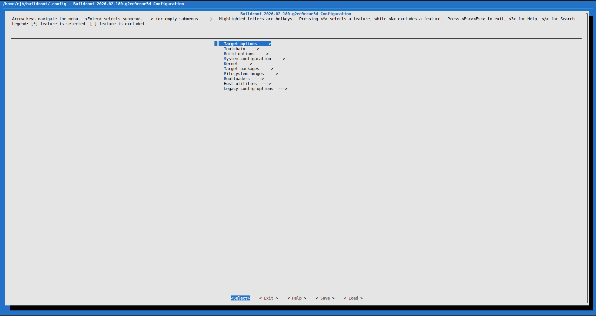

# 本文档详细介绍了几种制作sysroot的方法
## 发行版rootfs
```bash
# ubuntu 24.04.4版本 rootfs
$ wget https://cdimage.ubuntu.com/ubuntu-base/releases/noble/release/ubuntu-base-24.04.4-base-riscv64.tar.gz
$ sudo mkdir -p ~/ubuntu-sysroot
$ sudo tar -xzf ubuntu-base-24.04.4-base-riscv64.tar.gz -C ~/ubuntu-sysroot
# openruyi rootfs
$ wget https://releases.openruyi.cn/creek/2026.03/rva23/openRuyi-2026.03-rootfs-oci.tar.zst
$ sudo mkdir -p ~/openRuyi-sysroot
$ sudo tar -xzf openRuyi-2026.03-rootfs-oci.tar.zst -C ~/openRuyi-sysroot
```
安装结束后则可以通过相应的包管理器进行安装依赖等
```bash
$ sudo chroot ~/openRuyi /bin/bash
$ dnf/apt update
$ dnf/apt install 
```

### 常见问题
chroot 环境里没有 DNS 解析
```
# 先退出chroot
$ exit
$ sudo cp /etc/resolv.conf ~/openRuyi/etc/resolv.conf
$ sudo chroot ~/openRuyi /bin/bash
```

dnf/apt包管理器等缺少相应依赖，则可以通过手动编译的方式进行补充(这里的rootfs借用了openeuler操作系统，注意审题)

在依赖库目录下编写riscv64.toolchain文件(为了方便补充缺少的依赖手动编译riscv文件，我在依赖库目录下也创建了虚拟环境)
```bash
$ set(CMAKE_SYSTEM_NAME Linux)
$ set(CMAKE_SYSTEM_PROCESSOR riscv64)

$ set(CMAKE_C_COMPILER /home/cjh/桌面/依赖库/ruyi-venv-sipeed-lpi4a/bin/riscv64-plctxthead-linux-gnu-gcc)
$ set(CMAKE_CXX_COMPILER /home/cjh/桌面/依赖库/ruyi-venv-sipeed-lpi4a/bin/riscv64-plctxthead-linux-gnu-g++)

$ set(CMAKE_SYSROOT /home/cjh/oe-sysroot)
$ set(CMAKE_FIND_ROOT_PATH /home/cjh/oe-sysroot)

$ set(CMAKE_FIND_ROOT_PATH_MODE_PROGRAM NEVER)
$ set(CMAKE_FIND_ROOT_PATH_MODE_LIBRARY ONLY)
$ set(CMAKE_FIND_ROOT_PATH_MODE_INCLUDE ONLY)
$ set(CMAKE_FIND_ROOT_PATH_MODE_PACKAGE ONLY)
$ add_definitions(-DANGELSCRIPT_EXPORT -DAS_RISCV64)
```
依赖补充流程类似如下

```bash
$ cd ~/桌面/依赖库
$ wget https://github.com/libsdl-org/SDL_mixer/releases/download/release-2.6.3/SDL2_mixer-2.6.3.tar.gz
$ tar -zxvf SDL2_mixer-2.6.3.tar.gz
$ cd SDL2_mixer-2.6.3
```
配置交叉编译
```bash
$ mkdir build && cd build
$ cmake .. \
  -DCMAKE_TOOLCHAIN_FILE=/home/cjh/桌面/依赖库/riscv-toolchain.cmake \
  -DCMAKE_BUILD_TYPE=Release \
  -DCMAKE_INSTALL_PREFIX=/home/cjh/oe-sysroot/usr
```

编译并安装到 Sysroot
```bash
$ make DESTDIR=/home/cjh/oe-sysroot install
```

## buildroot
可以通过 Buildroot 一键配置、自动交叉编译所需的第三方库与系统组件，生成与目标平台完全兼容的依赖文件，解决开发中依赖缺失问题。

### 配置buildroot
```bash
$ make menuconfig
```

#### 架构选择
在`Target options` -> `Target Architecture` -> `RISCV`


在`Target options` -> `Target Architecture Variant` -> `Custom architecture`


#### 工具链选择
在`Toolchain` -> `Toolchain type` -> `External toolchain`

在`Toolchain` -> `Toolchain` -> `Custom toolchain `

在`Toolchain` -> `Toolchain` -> ` Toolchain origin (Pre-installed toolchain)`->`/home/cjh/buildroot/ruyi-venv-sipeed-lpi4a`

(这里是你当前虚拟环境工具链的路径，到虚拟环境即可，由于可能识别不到中文，建议放在主目录下即可)  
在`Toolchain` -> `Toolchain` -> `Toolchain prefix`-> `riscv64-plctxthead-linux-gnu`

(这里是交叉工具链的前缀)  
以及一些工具链的相关参数，可以用 `riscv64-plctxthead-linux-gnu-gcc -v` 查到一些，如果填错也没关系，buildroot在make阶段报错会提醒的，之后再改也可以。


### 剩余选项


### 依赖补充
在`Target Packages`里可以根据分类选择你所需要的依赖即可，选择与否可以用空格确定，如果找不到的话，你也可以通过`/`键快速搜索确定位置


### 编译
确定好所需依赖(如果有依赖没选上的make失败后也可以重新补充)后通过`ESC`退出确认配置
```bash
# 编译依赖
$ make
```

## Yocto

